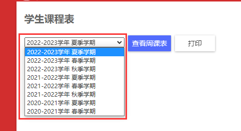
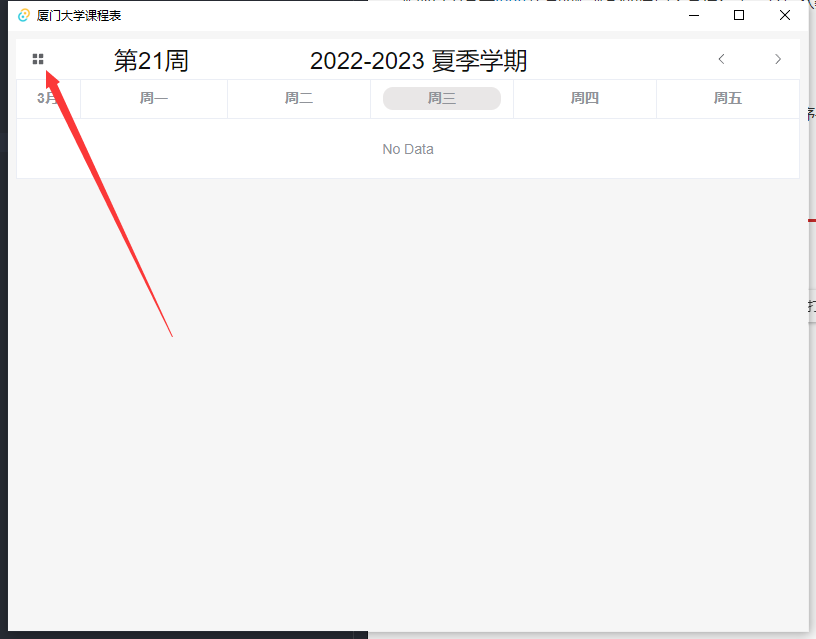
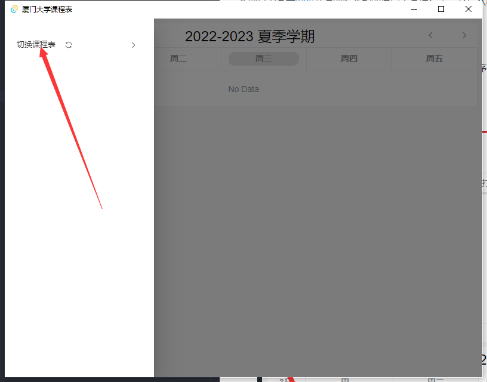
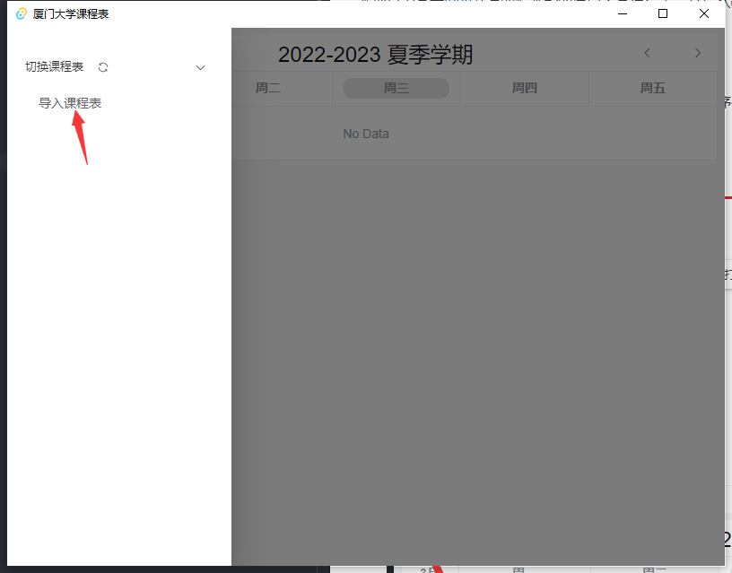
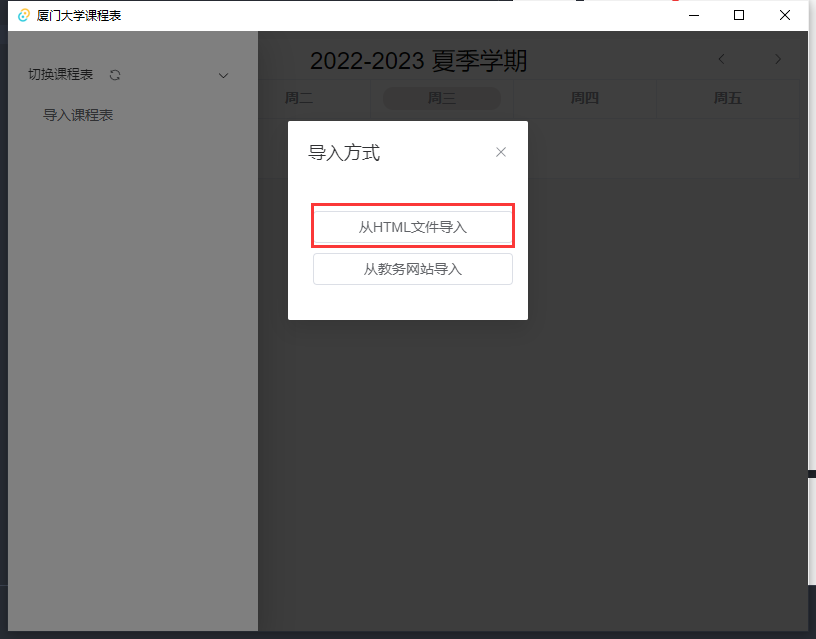
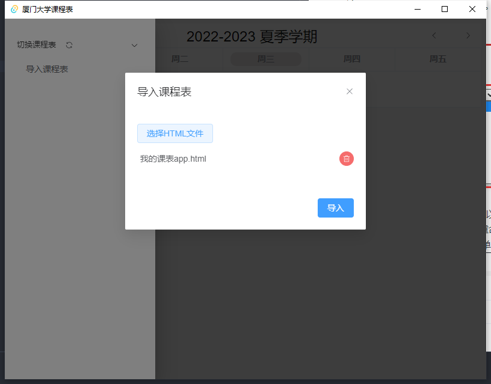
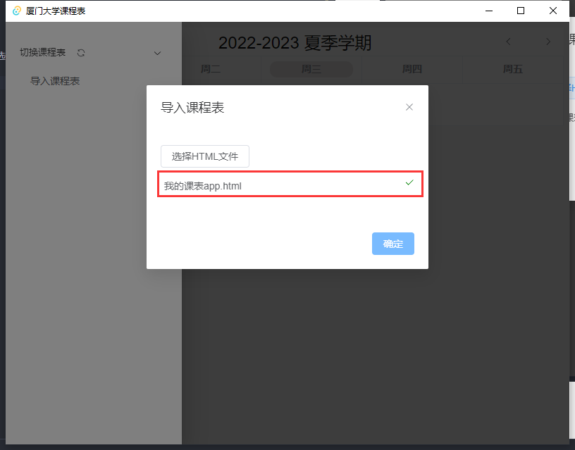
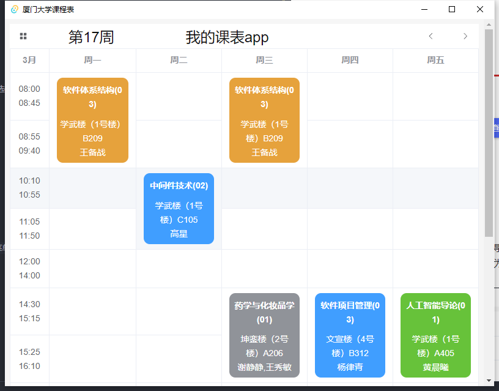

# XMU-CLASS-SCHEDULE

本项目为基于[tauri](https://next--tauri.netlify.app/)开发的跨平台的厦门大学课程表。支持从教务系统直接导入课程表而不需要手动输入。

## 课程表导入教程

### 手动下载并导入

1. 访问[https://jw.xmu.edu.cn](https://jw.xmu.edu.cn)并登录。
2. 打开`我的课表app`
3. 选择要导入的学期 
4. 右键 -> 另存为，保存在一个你可以找得到的地方。
5. 将下载的`我的课表app.html`文件重命名为你想要的名字，比如`2020-2021-1.html`。
6. 打开本程序，点击左上角打开菜单 
7. 点击`切换课程表` 
8. 点击`导入课程表` 
9. 选择`从HTML文件导入` 
10. 在弹出的对话框中选择刚才保存的文件，只需要选择以`.html`结尾的文件（即不需要选择`我的课表app_files`文件夹和其中的内容），且可以同时选择多个 
11. 点击`导入`后程序会自动将课程表导入，显示对勾即为导入成功 
12. 点击`确定`即可关闭对话框
13. 在菜单中点击导入的课程表即可启用课程表 
14. 完成 
15. [可选] 删除步骤4中下载的所有文件

### 从程序中访问教务系统并导入

开发中...

## 课程表的删除与重命名

目前暂不支持直接删除与重命名课程表，请等待后续更新。电脑端用户可以通过访问`data/schedules`文件夹来手动删除或重命名课程表。并在点击程序菜单中`切换课程表`旁的刷新按钮或重启程序即可。

## 安全问题

本程序承诺不保存任何学号和密码的相关信息，仅保留必要的课程表内容。所有内容在`data`文件夹下以`json`格式明文保存，你可以自行查看。使用本程序访问教务系统时，本程序将直接调用浏览器接口进行访问，与日常中直接使用浏览器访问教务系统并无区别，因此不存在安全问题。本程序承诺不会监控、记录、上传任何你的任何操作和信息，所有操作均在本地完成，数据也保存在本地。

本程序仅供学习与交流使用，本程序不承担任何因使用本程序而导致的任何问题。